# dragn-emoji
A small collection of old-Noto blob-esque dragon emoji

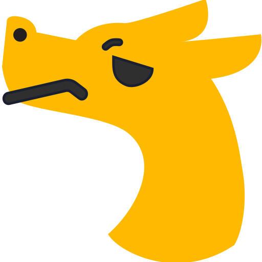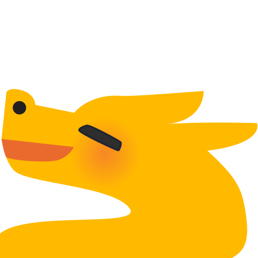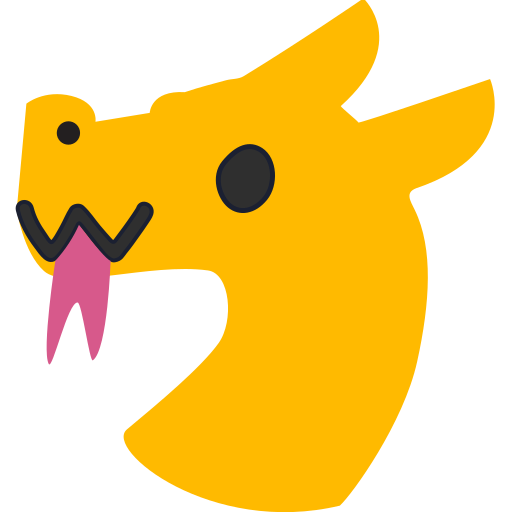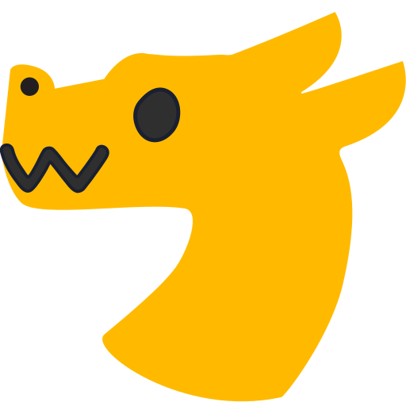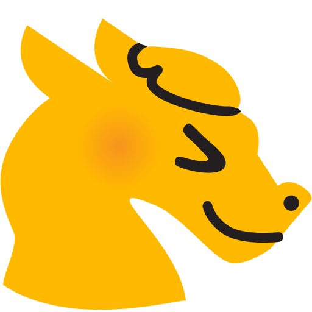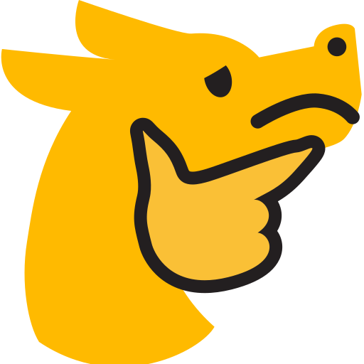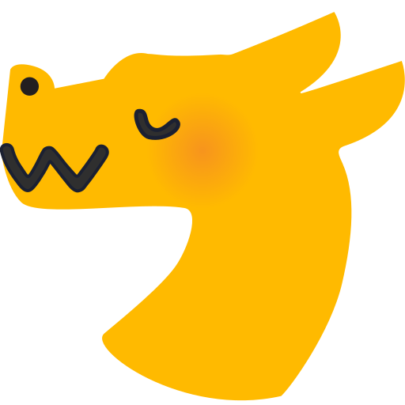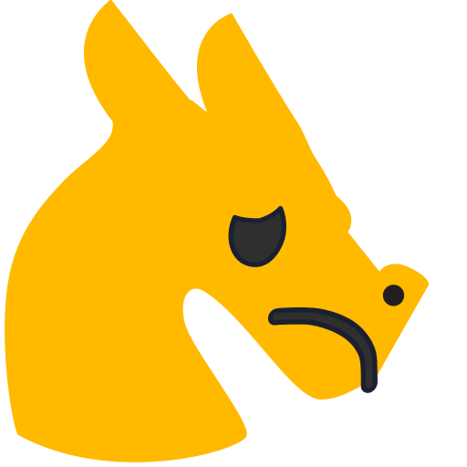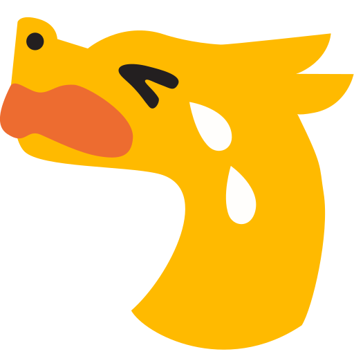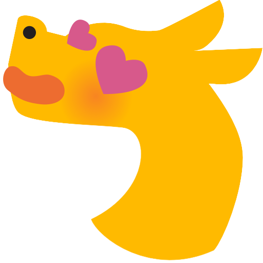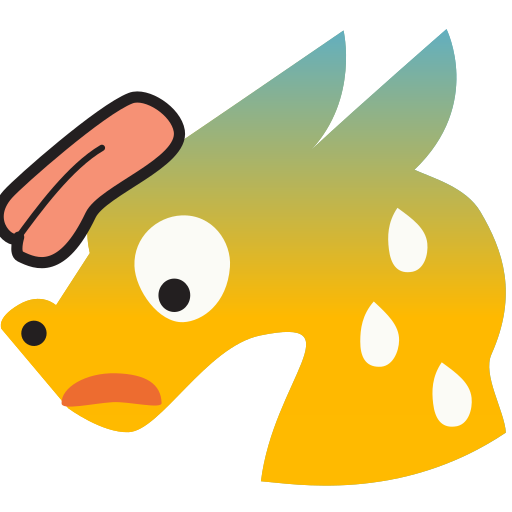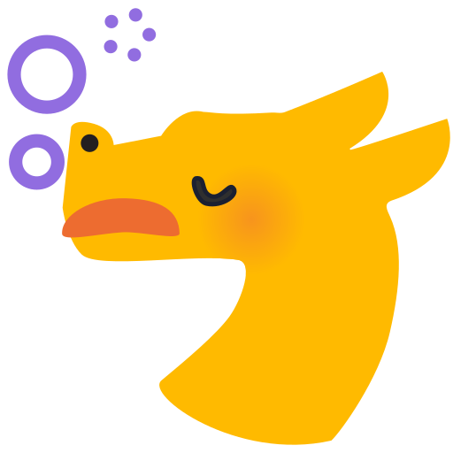

These emoji are licensed under Creative Commons Attribution-NonCommercial-ShareAlike 4.0 International. That means you can use and remix these emoji as long as you give appropriate credit, don't use them for commercial purposes, and distribute adaptations under the same license. See the [official webpage](https://creativecommons.org/licenses/by-nc-sa/4.0/) for more details.
